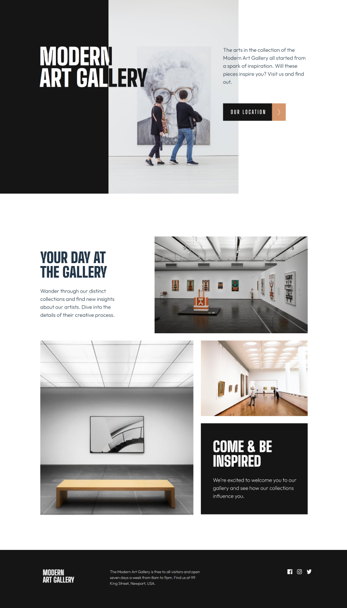
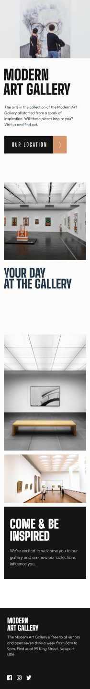

# Frontend Mentor - Art gallery website solution

This is a solution to the [Art gallery website challenge on Frontend Mentor](https://www.frontendmentor.io/challenges/art-gallery-website-yVdrZlxyA). Frontend Mentor challenges help you improve your coding skills by building realistic projects. 

## Table of contents

- [Overview](#overview)
  - [The challenge](#the-challenge)
  - [Screenshot](#screenshot)
  - [Links](#links)
- [My process](#my-process)
  - [Built with](#built-with)

## Overview

### The challenge

Users should be able to:

- View the optimal layout for desktop and mobile
- Set hover state of the button on mouse events for desktop, touch events for mobile

### Screenshots

  
  

### Links

- Live Site URL: [https://tiresome-observation.surge.sh/](https://tiresome-observation.surge.sh/)

## My process
  - I began by roughing out the general shape of the site with some empty components and tailwind utility classes.  I planned to use tailwind classes for the broad shape of the project and then plain css for the finer details. 
  - As I began measuring pixels and inserting more precise values, I felt that the mobile layout and desktop layout were different enough to warrant separate components.  I did this in the interest of being as accurate as possible in the timeframe of about a week, but it could be re factored as single components with more breakpoints added. 
  - I spent some time up front with what I felt would be the most time consuming part, and that was getting the color blend on the word 'Modern' right and I tried a couple of different approaches there.  My first thought was the CSS blend mode property, but I didn't find this precise enough so I used some css pseudo classes to get the right effect.  
### Built with

- Adaptive Design
- Mobile first workflow
- Conditional rendering
- [React](https://reactjs.org/) 
- [Vite](https://vitejs.dev/) 
- [Tailwind](https://tailwindcss.com/) 

### Author
  [Andrew Donovan](https://www.linkedin.com/in/andrew-donovan-020099266/)